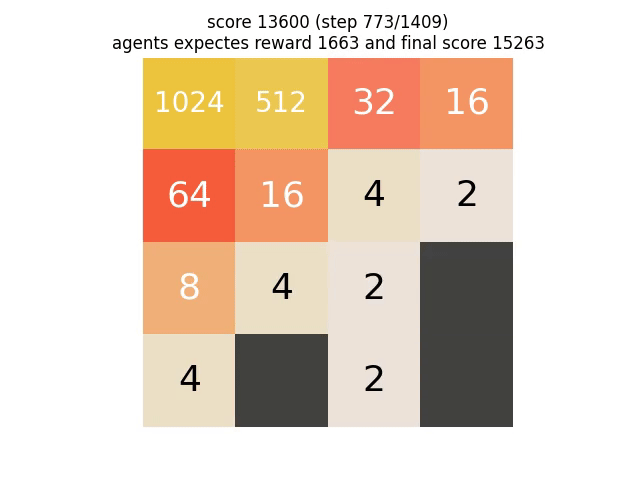

# 2048 Reinforcement Learning

### Watch the agent reaching the 2048 tile



Here you can find the full video

[](media/n4-tuple_network_MC_avg_vote/n4_avg_MC_lambda_2048_score_27172.mp4)


### Installation

The project has three parts:
* The numpy / gymnasium implementation as a standalone module
* The final notebooks + trained model found in the project root
* The dev folder containing the notebooks with experiments

The module is designed to also contain the dependencies for the notebooks. To install, simply tipe

```bash
conda create -n andreas2024 python=3.13
pip install 
```