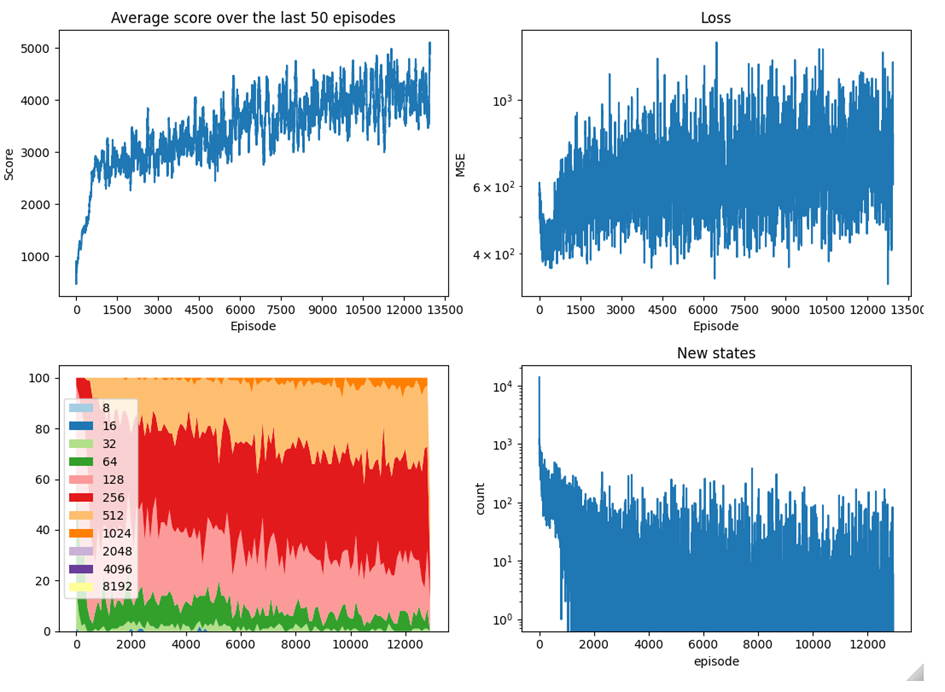
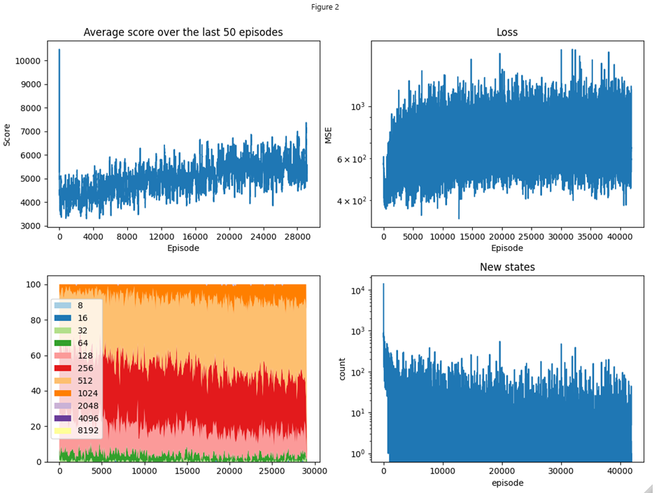

# n4-Tuple network with average voting, optimistic initialization and lambda MC 

### Training

The model was trained in two batches. The fist up to around epsiode 17,000 and the second up to around episode 42,000. The agents reaches the tile 2048 several times during the training episodes and settles around a mean score of 5,500

##### Batch 1 Training process:

##### Batch 2 Training process:

The upper left plot are the average result of the last 50 episodes in terms of game score. The loss is calculated in the training phase (L1Loss). The new states plot on the bottom right is counting how many of the tuples in the training batch were never visited by the agent before. This is possible as all tuples were initialized with an optimistic value of 2,000. Last, the bottom left shows the tile distribution of the last 100 episodes.

Note: The episode counting in the plot for batch 2 has a wrong axis for the average score and the highest tile distribution both NOT including the previous training results (they could not be stored on disk as the file would be over a 1GB in size). Also, the peak an the very first episode in batch 2 is due to averging only the first game (which was by luck very good)